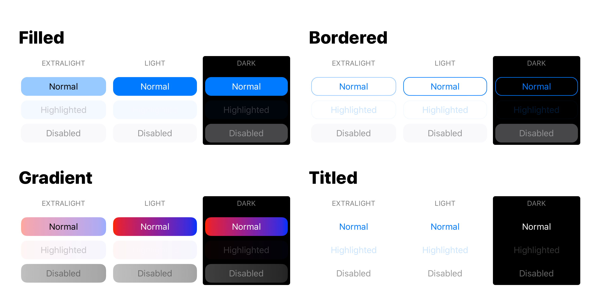

# roundrect

Conveniences for programmatically generating image assets and styling UIButton.

## Creating Images
The conveniences in `ImageGeneration.swift`  allow images to be generated from a view, or given various style properties like fill, stroke, corner radius, etc. For example, to create a 3px/3px image with a 1px blue stroke and a single red fill:
```swift
let image = UIImage(
  fill: .red,
  stroke: (
    color: .blue, 
    width: 1
  )
)
```
This image can be made resizable and applied to a `UIButton`, but since there is a lot of busywork associated with handling all the different states a button can have, the conveniences in `ButtonStyle` can be used instead. A combination of a button `Style` (eg. filled vs bordered) and `Theme` (eg. light or dark) can be provided when creating or modifying an existing `UIButton`:
```swift
let button = UIButton(
  style: .filled(
    cornerRadius: 8
  )
)
```
This will yield a button with a tintable fill and a corner radius of 8.

API exists for an explicit `theme` to be provided, but it's marked as obsolete as of iOS13 in favour of light/dark mode provided by `UIInterfaceStyle`.

## Examples

<iOS13 variations with explicit themes


iOS13+ variations for light and dark mode
| light | dark |
|  |  | 
